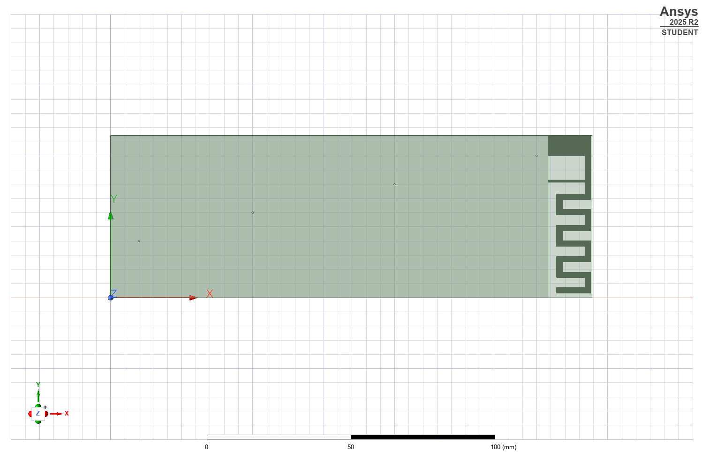
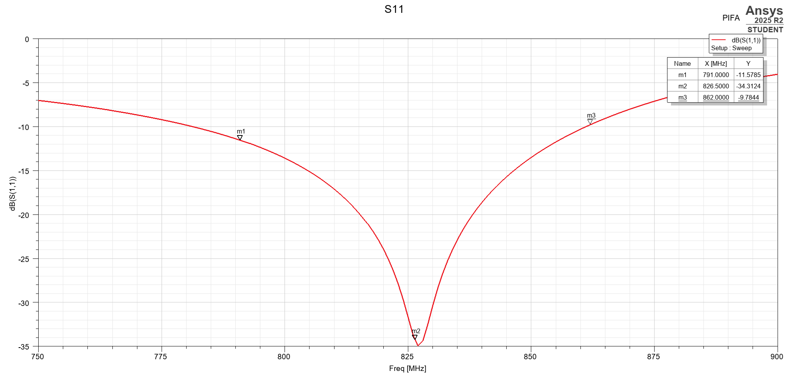
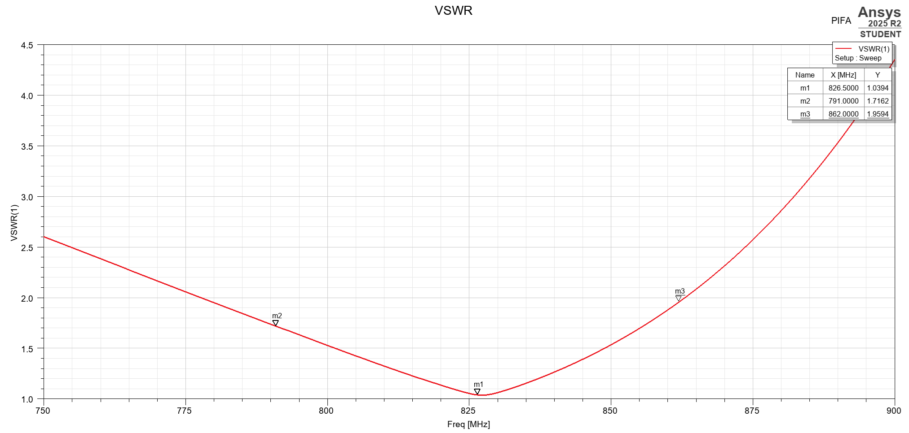
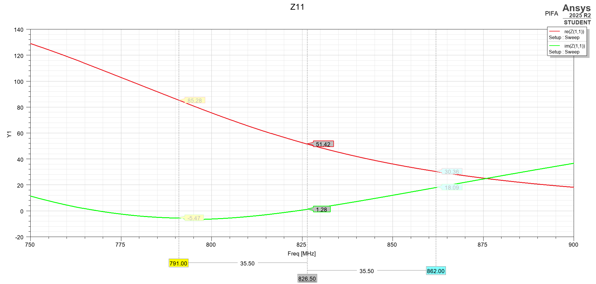

Antenna design
##############

Target and environment
======================

The antenna was designed to work with LTE band 20 and to prefer the uplink frequencies more than the downlink frequencies. The lowest downlink frequency is 791 MHz and the highest uplink frequency is 862 MHz. The center frequency is thus 826.5 MHz.

The antenna is located on a 1.6 mm thick board with an assumed dielectric constant of 3.91 and a loss tangent of 0.02 between the antenna and the RF ground. There should be a copper keep-out area on the same layer as the antenna and on all layers below it.

As a success criteria, the S11 parameter (50 ohm normalized) value should be below -6 dB for the bandwidth edges and below -20 dB for the center frequency. The VSWR should be thus below 3 for the bandwidth edges and near 1 for the center frequency.

There is no enclosure specified so assume that there isn't one.

Simulation and design
=====================

The antenna was simulated and designed using Ansys Electronics Desktop Student 2025 R2 HFSS.

Antenna
-------

S parameter
-----------

VSWR
----

Z parameter
-----------

